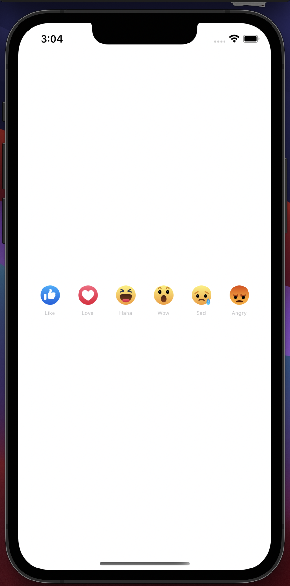

# Facebook Like Button

This is an implementation of Facebook's Like Button Reactions in React Native.

## Features

- Uses React Native Animation Library.
- SVG implementation.
- Cross platform (Supports Both iOS and Android)

## Installation

Clone this repository.

```bash
  git clone

  cd emojiButton
```

Install the Dependencies

```bash
  yarn install

  cd ios && pod install
```

Run it on your device

```bash
  react-native run-ios
```

or

```bash
  react-native run-android
```

## Screenshot and Demo


